# [UI Lovelace Minimalist](https://ui-lovelace-minimalist.github.io/)

## Preview of [Minimalists](ui-lovelace_s.yaml)

### Dashboard

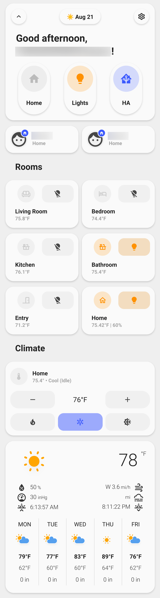

### Home

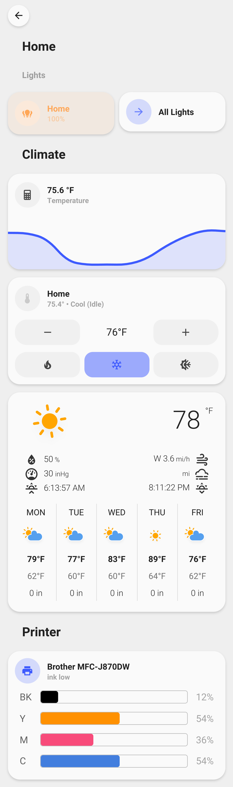

### Lights

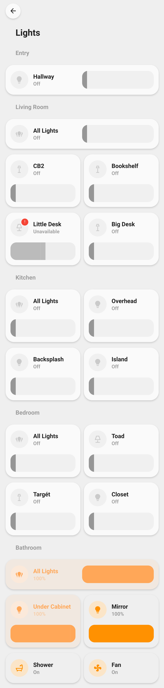

### Home Assistant

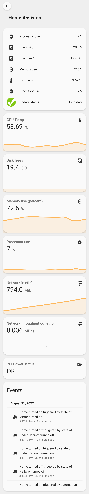

### Living Room

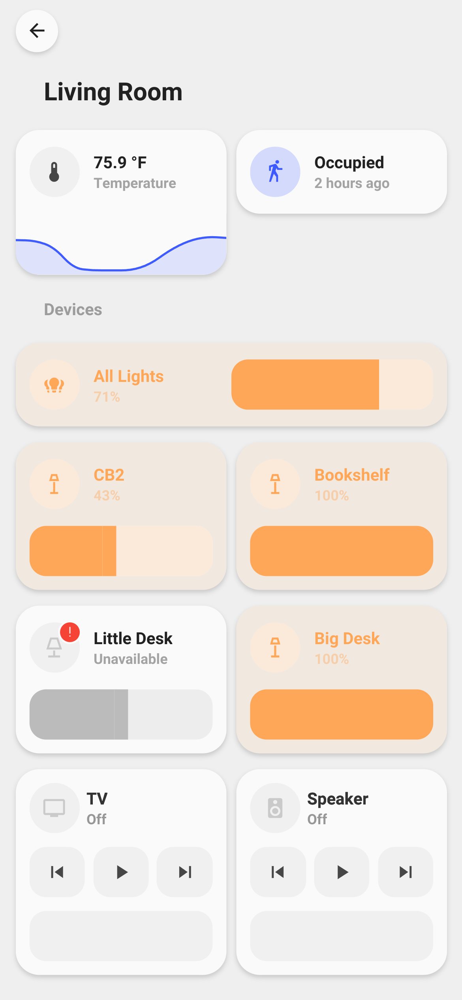

### Bedroom

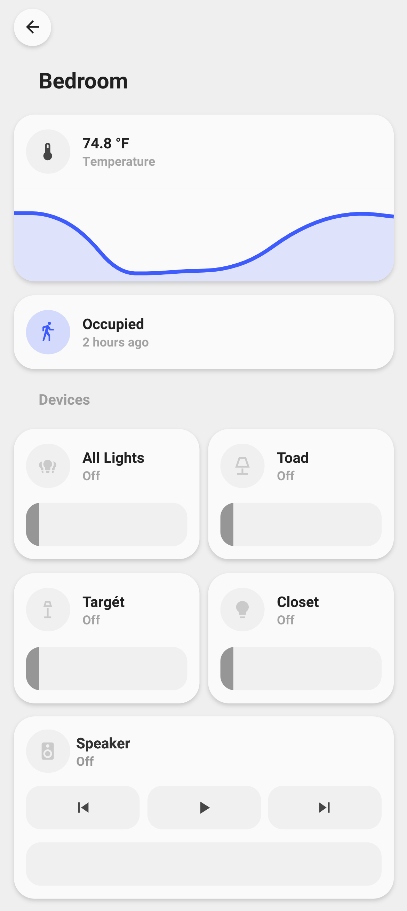

### Kitchen

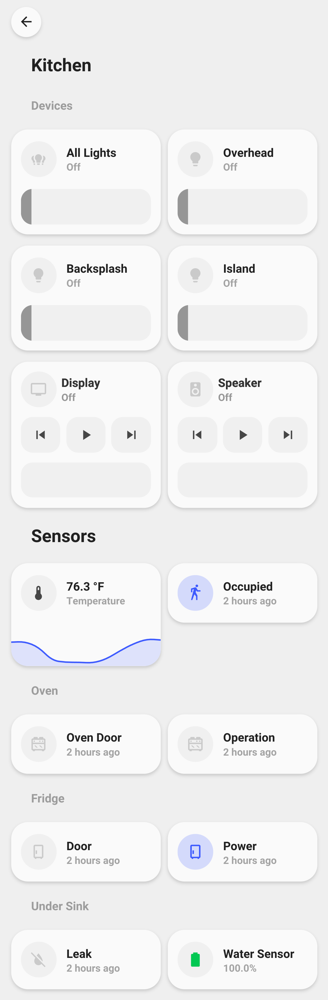

### Bathroom

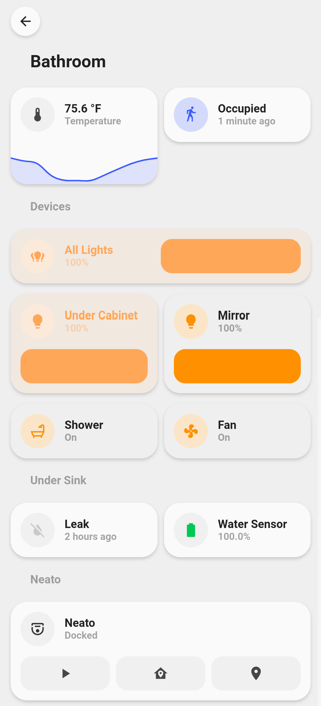

### Entry

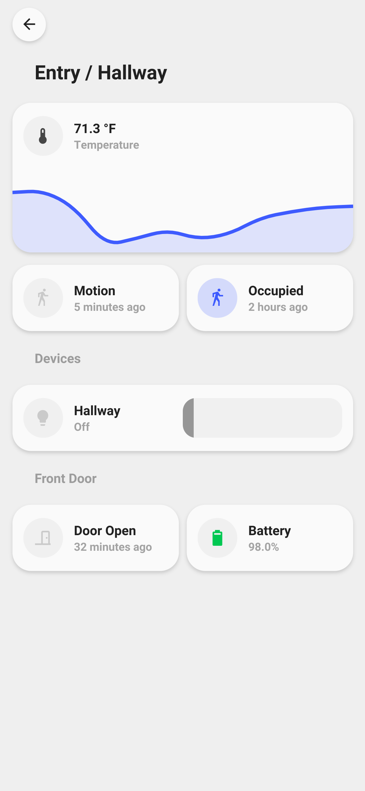

### Car

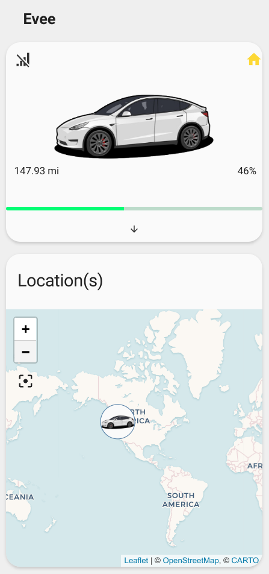

Expanded

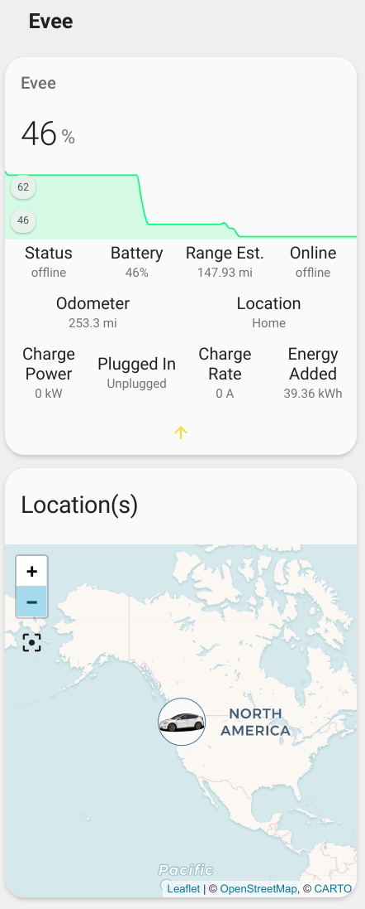
